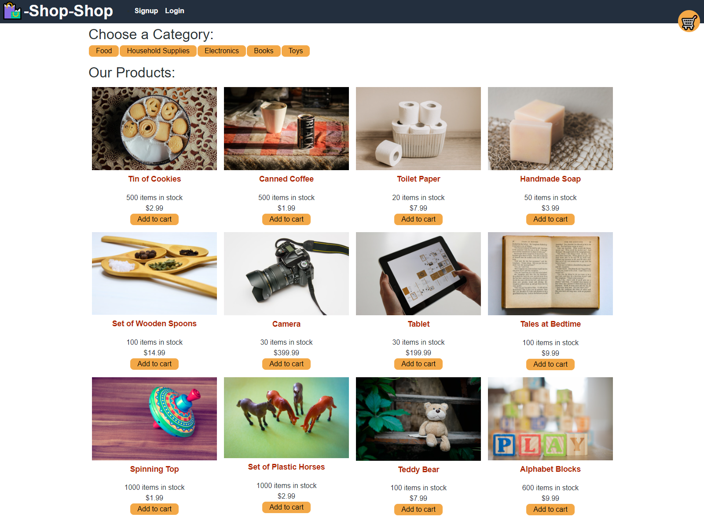

# Shop-Shop Version: Redux

## Description
Shop-Shop is an e-commerce platform that utilizes the MERN stack and Redux to provide a modern progressive web application to the world. User's can browse Shop-Shop's product offerings and filter products based on category preferences. If they find an item they like, they have the ability to add it to their cart. Items saved to the cart persist over multiple vists so the user never has to worry about leaving the site. Items in the cart can also be removed or have purchase quantities changed. Once the order is complete, users can log into their account to checkout the order via Stripe! Give Shop-Shop a shot today!!

## Table of Contents

* [Installation](#Installation)
* [Usage](#Usage)
* [License](#License)
* [Questions](#Questions)
* [Credits](#Credits)

## Installation
Visit Shop-Shop by clicking [here]()!

## Usage
Navigate to the home page and begin using Shop-Shop like any other e-commerce website! View products for sale, add them to your cart, and checkout your order!
  
Shop-Shop home page: 
 

## License
MIT License

## Questions
You may contact the project author via:
* Email: seanbrent5@live.ca
* GitHub: [Brentsa](https://github.com/Brentsa)

## Credits
Sean Brent